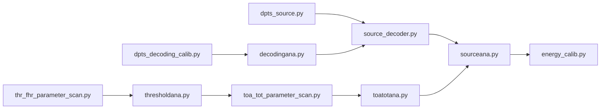

# Measurement and analysis procedure for Fe55 with DPTS

To produce the final ToT spectrum and energy calibration from measurements with an Fe55 source, a few scans need to be conducted. Below is a flow chart showing all the scripts that are run for the full measurement and analysis chain. 



Don't forget all scripts have a help message that can be dispayed with `-h`.

## 1. Take the Fe55 data

To perform the Fe55 measurement run:

```
./dpts_source.py --trg_ch CHANNEL
```

Note: for this script, you will need to give the channel that is connected to the positive CML, as the trigger channel via `--trg_ch`, for example channel `B`. You can also set the number of events for the scan with `--ntrg`.

## 2. Decoding calibration and analyse

A decoding calibration needs to be taken so that the PID/GID information can be decoded into rows and columns. Run with:

```
./dpts_decoding_calib.py
```

You will need to run the analyse twice in order to produce a calibration for the rising and falling sets of trains.

For the falling edge:

```
./decodingana.py DATA_FILE.npy --save-calibration NAME_OF_CALIB_FALLING --falling-edge
```

For the rising edge:

```
./decodingana.py DATA_FILE.npy --save-calibration NAME_OF_CALIB_RISING
```

## 3. Source decoder

To decode the Fe55 results and obtain the ToT for each of the hits, run:

```
./source_decoder.py FE55_DATA_FILE NAME_OF_CALIB_RISING NAME_OF_CALIB_FALLING
```

Note: this produces a file called `FE55_DATA_FILE_decoded.npy`.

## 4. Threshold scan and analyse

Need to perform a threshold scan over the whole matrix at the same settings as the Fe55 measurement. For ease of use with the ToT calibration, the script in `scripts/dpts/` is used:

```
./thr_fhr_parameter_scan.py CONFIG_FILE.json
```

Then run the analyse with:

```
./thresholdana.py PATH_TO_DATA_FOLDER/FILE.npy --outdir PATH_TO_DATA_FOLDER
```

## 5. ToT scan and analysis

Can then use the analysed threshold results as input for the ToA and ToT scans. In `scripts/dpts/`, run with:

```
./toa_tot_parameter_scan.py CONFIG_FILE.json
```

Note: make sure the `thrmap_dir` parameter in the config file points to the analysed threshold scan (a file ending in `_analyzed.npz`)

Then the results can be analysed:

```
./toatotana.py PATH_TO_DATA_FOLDER/FILE.npy --outdir PATH_TO_DATA_FOLDER --thrmapFile ANALYSED_THR_SCAN
```

## 6. Analyse source data

To produce the ToT spectrum measured from the Fe55 data, run:

```
./sourceana.npy FE55_DATA_FILE_decoded.npy --calToT ANALYSED_TOT_SCAN
```

## 7. Energy calibration

Finally, to produce an energy calibration that converts mV to electrons run:

```
./energy_calib.py ANALYSED_SPECTRUM
```
