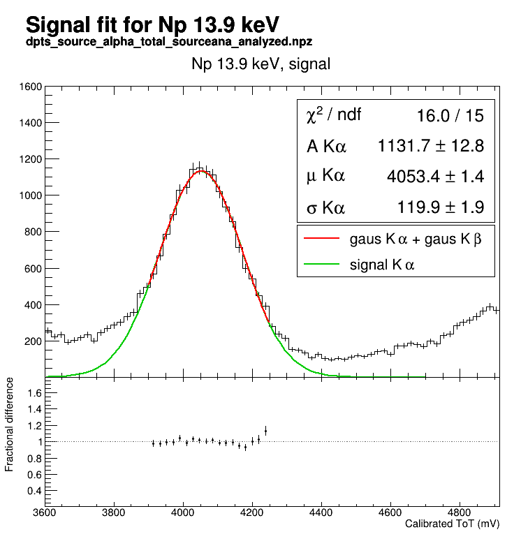
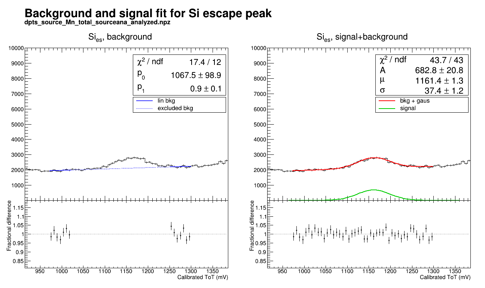
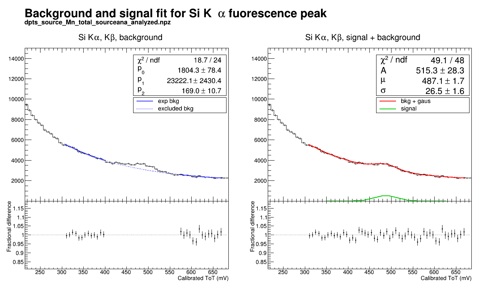
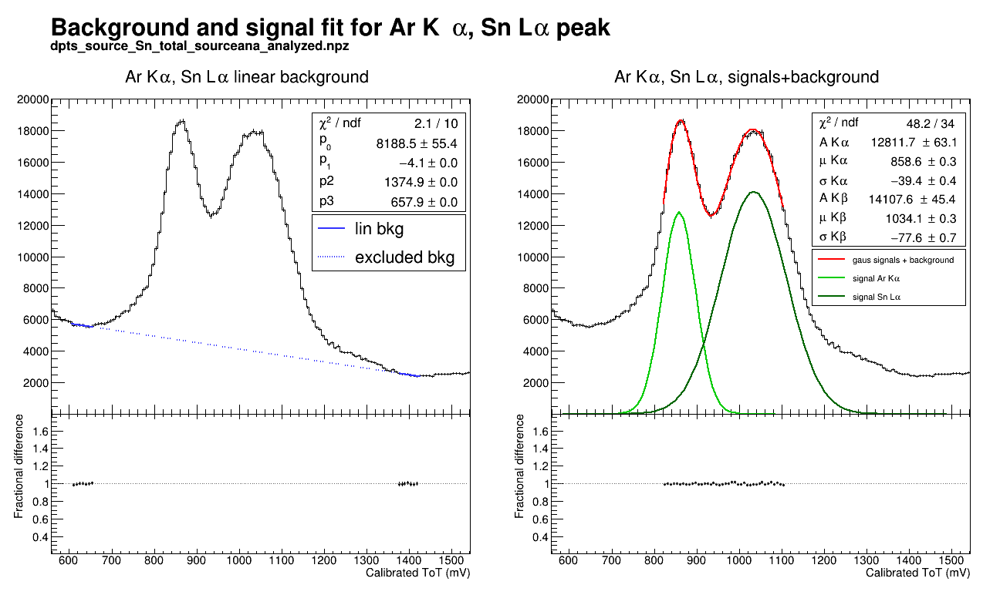
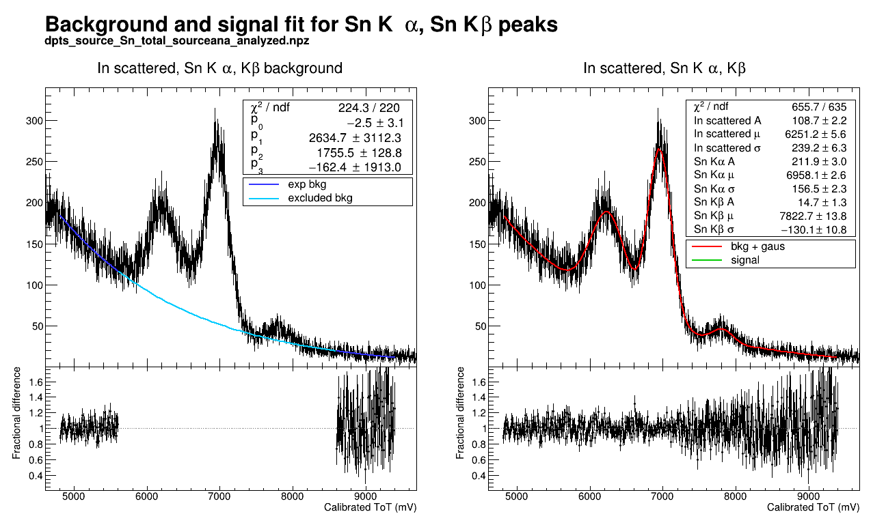

## Code for the fit of a generic source spectrum
The following functions to do the fit of different combinations of signals and bakgrounds are implemented in the folder `utils`:
1. `noBkg_gausSig.py` does the fit of a gaussian signal without background
2. `linBkg_gausSig.py` does the fit of a linear background + gaussian signal
3. `expBkg_gausSig.py` does the fit of an exponential background + gaussian signal
4. `noBkg_2gausSig.py` does the fit of two partially overlapping gaussian signals
5. `linBkg_2gausSig.py` does the fit of a linear background + two partially overlapping gaussian signals
6. `expBkg_3gausSig.py` does the fit of an exponential background + three partially overlapping gaussian signals

The script `source_fit.py` uses these functions to do the fit of an $^{55}$Fe source spectrum and the energy calibration.

**Input:**

1. Output of [sourceana.py](analysis/dpts/sourceana.py): .npz file with the calibrated spectrum in mV
2. File `.json` with the parameters to be used for the peak fits.

**Output:**

Plots of the peak fits and fractional difference between the fit and the data.
`json` file with some useful quantities, including the mean value of the peaks and their energy resolution.

**How to use**

The functions in the folder `utils` can be used as shown in `source_fit.py` to fit spectra from different sources.
It will be necessary to initialise the parameters for the fits accordingly to your data. An example for each fit functiion is reported in `source_fit.py` between L18 and L109.

**Tips**

Best to not use with Root in batch mode, it might affects the graphical layout of the histograms (i.e. not display dashed and dotted lines).

**Example output plots**
Output example for each function:

1. gaussian signal without backgound (`noBkg_gausSig.py`)

2. linear background + gaussian signal (`linBkg_gausSig.py`)

3. exponential background + gaussian signal (`expBkg_gausSig.py`)

4. 2 gaussian signals without background (`noBkg_gausSig.py`)

5. linear background + two gaussian signals (`linBkg_2gausSig.py`)

6. exponential background + three gaussian signals (`expBkg_3gausSig.py`)

